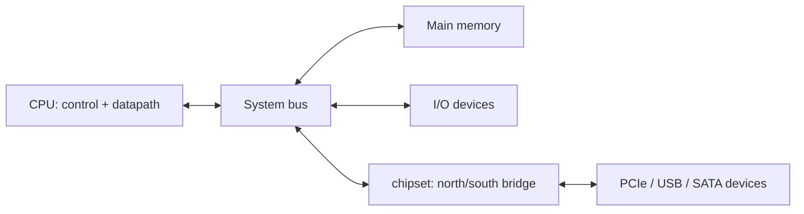

# Module 3 Article: Inside the CPU and the System Bus

## The big idea

A computer is a set of **components** that exchange data over shared **wires
(buses)**. The CPU, memory, and I/O are connected by the **system bus**, and a
chipset routes traffic between fast and slow parts. Understanding the bus and
the CPU's internal datapath/control split is the key to reading any computer
architecture diagram.

## Core components at a glance



| Component | One-line role |
|---|---|
| CPU | Fetches, decodes, and executes instructions |
| Memory | Holds program + data while running |
| I/O | Connects keyboard, disk, network, screen |
| System bus | Shared wires for data, address, control |
| Chipset | Arbitrates between CPU/memory and peripherals |

## The system bus in detail

A bus is a set of wires, but the data bus is **shared**, so only one device may
drive it at a time. The system bus has three groups:

- **Data bus:** carries data and instructions. **Bidirectional**. Width (e.g. 64
  bits) sets the natural word size.
- **Address bus:** carries the memory/IO address the CPU wants. Mostly
  **CPU → rest** (unidirectional). Width sets the addressable range (32-bit bus
  → 4 GiB).
- **Control bus:** `READ#`, `WRITE#`, `CLK`, `INTERRUPT#`, `RESET#`. Mostly
  CPU → rest, plus some bidirectional lines (interrupt request, acknowledge).

## Bus hierarchy: fast near, slow far

A single bus is a bottleneck. Real CPUs use **multiple buses** in a hierarchy:

1. **Core/private L1/L2:** inside/near the CPU core.
2. **CPU ↔ memory:** memory channels (DDR) or Infinity Fabric/UPI.
3. **PCIe lanes:** GPU, NVMe SSD, network — directly from CPU.
4. **Chipset bus (DMI/PCIe ×4):** southbridge for USB, SATA, audio, etc.

Each layer trades **speed** (top) vs **distance/breadth** (bottom).

## Inside the CPU: datapath and control

The CPU has two inseparable parts:

1. **Datapath:** registers, buses, multiplexers, ALU.
2. **Control unit:** generates control signals.

In MiniCPU's single-cycle datapath:

```
Registers → MUXes → ALU → result; Register file writes; PC updates.
Control: opcode → control lines (ALUOp, RegDst, ALUSrc, MemRead, MemWrite,
RegWrite, MemtoReg, PCSrc).
```

The control unit reads the **opcode** field of the instruction and decodes it
into control signals. **Hardwired control** = combinational logic; **microprogrammed
control** = a microcode ROM holding control words.

## CPU components in a modern processor

A modern CPU core contains far more than the textbook datapath:

- **Register file** (e.g., 31 × 64-bit GPRs in AArch64).
- **ALU / FPU** for integer and floating-point work.
- **L1 caches** (split I-cache and D-cache, ~32–48 KB each).
- **L2 cache** (private per core, ~512 KB–1 MB).
- **Branch predictor**, **return stack**, and **BTB** to keep the pipeline fed.
- **Reorder buffer / reservation stations** for out-of-order execution.
- **MMU** for virtual memory (next module).

## Arbitration and chip select

When several devices share a bus, **arbitration** decides who goes next. Two
styles:

- **Daisy chain:** priority is fixed by position (lower priority devices later).
- **Centralized/distributed arbitration:** a dedicated arbiter grants access.

A **decoder** performs **address decoding**: a device sees the address bus and
activates its **chip-select** line only for addresses in its range. That is how
the CPU "talks" to one device at a time on a shared bus.

## Hardwired vs general-purpose

- A **hardwired/special-purpose** system (traffic-light controller, embedded
  microcontroller) runs one fixed program in ROM; no OS, no reprogramming.
- A **general-purpose PC** loads and runs any compatible program from disk under
  an OS, using standard buses and a programmable ISA.

## Exam angle

For a "label the system bus" diagram:

1. Identify **data bus** (bidirectional, wider).
2. Identify **address bus** (one-directional, CPU → memory).
3. Identify **control bus** (read, write, clock, interrupt).
4. Mark the **chipset** as the bridge between the CPU/memory side and the
   peripheral side.
5. Add **bus arbiter** if the question mentions multiple bus masters.

> Tip: if asked about the "two parts of the CPU," always say **datapath** and
> **control unit** — never "ALU and registers" (those belong to the datapath).
