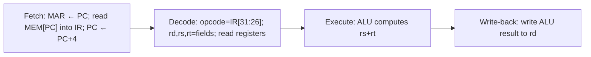

# Module 1: Introduction to Computing Systems

[↑ Semester I](../README.md) · [Subject index](README.md) · [Next: Module 2 →](<Module-2.md>)

## Learning outcomes

After this module, you should be able to:

- describe the evolution from mechanical calculators to stored-program computers;
- explain the role of machine language and the instruction cycle;
- define Instruction Set Architecture (ISA) and give two examples;
- trace one instruction through the fetch-decode-execute cycle;
- explain the role of the control unit in sequencing instructions.

## Prerequisites

No earlier module is required. Start with the plain-English overview and review each unfamiliar term before continuing.

## Study blocks

Study one block at a time. Work through its example and checkpoint before continuing.

| Block | Topic | Suggested time |
|---|---|---|
| 1 | Start here: the simple idea | 10-15 minutes |
| 2 | Important terms explained simply | 10-15 minutes |
| 3 | The fetch-decode-execute cycle in detail | 10-15 minutes |
| 4 | Instruction Set Architecture (ISA) | 10-15 minutes |
| 5 | Role and function of the Control Unit | 10-15 minutes |

## Start here: the simple idea

A computer is a machine that follows a list of instructions exactly. The big
historical idea, called the **stored-program** concept, is that the instructions
themselves can be stored in the same memory as the data and treated like data.

### Everyday analogy

Think of a kitchen. Early calculators were like a single-purpose appliance: a
toaster that can only toast. A stored-program computer is like a kitchen where
the recipe book lives on the same shelf as the ingredients, and the chef (the
control unit) reads one recipe step at a time, fetching ingredients (data) from
the shelves (memory), mixing them in bowls (registers), and updating the recipe
counter to the next step.

## Important terms explained simply

### Calculator to computer

- A **mechanical calculator** (e.g. Pascal's Pascaline, 1642) added and
  carried digits using gears. It solved one kind of problem only.
- A **programmable** machine (e.g. Babbage's Analytical Engine, 1870s) read
  instructions from punched cards, so it could solve many problems.
- A **stored-program** computer (e.g. EDVAC, EDSAC, 1940s-50s) keeps both the
  program and the data in the same electronic memory. Changing the program no
  longer needs rewiring; you simply load a new program.

### Machine language

**Simple meaning:** the only language the processor truly understands is a
string of 0s and 1s. Each number is an **instruction** that the processor can
decode directly.

For MiniCPU, the instruction `00000001 00000010 00000000 00100000` means
`ADD R1, R2, R0` (add `R2` and `R0`, store in `R1`).

**Technical meaning:** machine language is the binary encoding of an ISA. Each
instruction is split into fields: an opcode (operation code) and operand
fields (registers, addresses, or immediate constants). The processor decodes the
opcode to decide which circuit path to activate.

### Instruction sequencing

A program is a sequence of instructions in memory. The processor keeps a
**program counter (PC)** that points at the next instruction. Normally the PC
advances by one instruction; a branch or jump instruction changes it.

### Fetch-Decode-Execute Cycle

This is the heartbeat of every processor. One instruction is processed in three
overlapping stages:

1. **Fetch:** read the instruction at the current PC from memory.
2. **Decode:** read which operation it is and which registers it uses.
3. **Execute:** perform the operation (e.g., add two registers).
4. (Write-back and advance PC.)

### Control unit

**Simple meaning:** the control unit is the traffic-light system that tells
every part of the CPU what to do and when. It generates the control signals
that route data between registers, the ALU, and memory.

## The fetch-decode-execute cycle in detail

Using MiniCPU, here is how `ADD R1, R2, R0` (opcode `0`), 32 bits, is handled:

The **control unit** produces a sequence of control signals for each step
(e.g., `MemRead`, `IRWrite`, `ALUOp=ADD`, `RegWrite`). In a simple
**single-cycle** design, the whole instruction finishes in one clock; in a
**multi-cycle** design, several clocks share the datapath; in a **pipelined**
design, different instructions occupy different stages at the same time (Module 5).

## Instruction Set Architecture (ISA)

An **ISA** is the programmer-visible interface to the processor:

- the set of instructions and their binary encodings;
- the registers the program can see;
- the addressing modes;
- the memory model and exception/interrupt behavior.

Two classic examples:

| ISA | Style | Notes |
|---|---|---|
| x86 (Intel/AMD) | CISC | Variable-length, many addressing modes, billions of programs |
| ARMv8-A | RISC | Fixed 32-bit instructions (AArch32), 31 general registers |
| RISC-V | RISC | Open standard, modular, growing academic and industry use |

**Remember:** the ISA is the contract between software and hardware. The
microarchitecture (how it is physically built) can change without changing the
ISA.

## Role and function of the Control Unit

The control unit decides **what happens next** and **when**.

- It reads the opcode and generates control signals that steer the datapath.
- It sequences the program: it increments the PC, honors branches, and handles
  stalls and hazards.
- It can be **hardwired** (a fixed logic circuit, fast and inflexible) or
  **microprogrammed** (a small stored program of micro-operations, flexible and
  easier to change).

## Common mistakes

- Calling the OS, the compiler, or the ISA the "control unit." The control
  unit is a hardware block inside the CPU.
- Forgetting that the PC advances *before* or *after* fetch — both conventions
  exist; be consistent with your textbook.
- Confusing machine code (binary) with assembly (mnemonics like `ADD`).

## Memory rules

- Stored program = program and data share memory.
- Binary 0/1 is the only language the processor executes directly.
- Fetch reads instruction; Decode reads which instruction; Execute does it.
- Control unit = traffic lights; ALU = the calculator; registers = small fast storage.

## Check your understanding

1. What single historical idea made one computer programmable for many tasks?
2. In one sentence, what is the difference between an ISA and a microarchitecture?
3. List the stages of the fetch-decode-execute cycle in order.
4. What register always holds the address of the next instruction?
5. True or false: the control unit performs arithmetic on operands.

## Answers

Reveal answers after attempting the questions

1. The stored-program concept: store instructions in memory alongside data.
2. The ISA is the programmer-visible interface; the microarchitecture is the
   physical implementation of that interface.
3. Fetch → Decode → Execute → (Write-back) → advance PC.
4. The program counter (PC).
5. False — the control unit generates control signals; the ALU performs arithmetic.

## Quick revision box

- A stored-program computer keeps the program in the same memory as its data.
- Machine language is binary; assembly is a human-readable shorthand for it.
- The fetch-decode-execute cycle is how every instruction is processed.
- The control unit generates control signals and sequences execution.
- The ISA is the contract between software and hardware.

## Exam guidance

Draw the relevant block or timing diagram, label data movement, show the calculation, and explain the performance consequence.

## Practice ladder

1. **Easy - Recall:** Define the module's central idea in one or two sentences.
2. **Easy - Recognize:** Identify the correct method for a small example and explain why it fits.
3. **Medium - Apply:** Work through one representative problem without copying the example.
4. **Medium - Compare:** Contrast two methods or concepts from the module.
5. **Hard - Integrate:** Solve a university-style scenario and justify every major step.

Reveal self-evaluation guide

A complete response uses correct terminology, shows intermediate steps, connects the result to the scenario, and states one assumption or limitation.

---

[↑ Semester I](../README.md) · [Subject index](README.md) · [Next: Module 2 →](<Module-2.md>)
