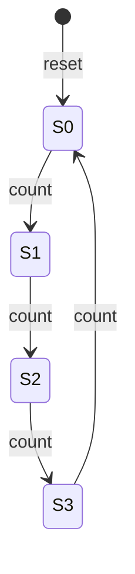

# Module 2: Digital Electronics

[← Previous: Module 1](<Module-1.md>) · [Subject index](README.md) · [Next: Module 3 →](<Module-3.md>)

## Learning outcomes

After this module, you should be able to:

- distinguish combinational and sequential logic;
- read binary place values and convert between binary, decimal, and hexadecimal;
- perform basic binary arithmetic and explain signed representations;
- build and trace basic logic gates and combinational circuits;
- describe D flip-flops and use them in state-based designs;
- convert a state machine into a datapath and control circuit.


## Prerequisites

Complete [Module 1](Module-1.md) first. Review its quick-revision section if any term below feels unfamiliar.

## Study blocks

Study one block at a time. Work through its example and checkpoint before continuing.

| Block | Topic | Suggested time |
|---|---|---|
| 1 | Start here: the simple idea | 10-15 minutes |
| 2 | Binary systems and number conversion | 15-20 minutes |
| 3 | Important logic terms explained simply | 10-15 minutes |
| 4 | Worked example: a 2-bit counter | 10-15 minutes |
| 5 | Building blocks of datapath and control | 10-15 minutes |


## Start here: the simple idea

Digital electronics works on a simple rule: every signal is either LOW (0) or
HIGH (1). Combinational logic produces an output from inputs **now**, with no
memory. Sequential logic adds memory: an output can depend on what happened
**earlier**, because storage elements (flip-flops) remember past values.

### Everyday analogy

- **Combinational:** a room of light switches. Each switch directly controls a
  lamp; the lamp's state depends only on the switches right now.
- **Sequential:** a turnstile at a stadium. It remembers whether the last
  person paid until a new ticket is presented; its output (locked/unlocked)
  depends on the current input **and** its memory of the past.

## Important terms explained simply

### Logic levels

| Level | Meaning |
|---|---|
| 0 (LOW) | False, off, below ~0.8 V |
| 1 (HIGH) | True, on, above ~2.0 V |

A **bit** is one binary digit. A **byte** is typically 8 bits.

## Binary systems

Binary is a **base-2 positional number system** using only `0` and `1`. From
right to left, its place values are powers of two: `1, 2, 4, 8, 16, ...`.

### Binary to decimal

Multiply each bit by its place value and add:

```text
(101101)₂ = 1×32 + 0×16 + 1×8 + 1×4 + 0×2 + 1×1
           = (45)₁₀
```

### Decimal to binary

Repeatedly divide by 2 and read the remainders from bottom to top:

```text
13 ÷ 2 = 6 remainder 1
 6 ÷ 2 = 3 remainder 0
 3 ÷ 2 = 1 remainder 1
 1 ÷ 2 = 0 remainder 1

(13)₁₀ = (1101)₂
```

### Binary, octal, and hexadecimal shortcuts

- Group binary digits in threes from the binary point for octal.
- Group them in fours for hexadecimal.
- Hexadecimal digits `A–F` represent decimal `10–15`.
- Example: `(1110 1011)₂ = (EB)₁₆`.

### Binary arithmetic

The essential addition rules are:

| Operation | Result | Carry |
|---|---:|---:|
| `0 + 0` | 0 | 0 |
| `0 + 1` or `1 + 0` | 1 | 0 |
| `1 + 1` | 0 | 1 |
| `1 + 1 + 1` | 1 | 1 |

Example: `(1011)₂ + (0110)₂ = (10001)₂`.

For subtraction, `0 − 1` requires a borrow from the next higher bit. Binary
multiplication uses the same shift-and-add idea as decimal multiplication.

### Unsigned and signed integers

- An unsigned n-bit number has range `0` to `2ⁿ − 1`.
- Sign-magnitude uses the top bit as a sign and has both `+0` and `−0`.
- One's complement negates by inverting all bits and also has two zeros.
- Two's complement negates by **invert, then add 1**. It has one zero and is the
  standard representation for signed integers.
- An n-bit two's-complement number has range `−2ⁿ⁻¹` to `2ⁿ⁻¹ − 1`.

For 8 bits, unsigned range is `0..255`; two's-complement range is `−128..127`.
Adding same-sign two's-complement operands causes signed overflow when the
result has the opposite sign.

### Binary fractions and BCD

Places to the right of a binary point have values `1/2, 1/4, 1/8, ...`.
Therefore `(10.101)₂ = 2 + 1/2 + 1/8 = (2.625)₁₀`.

**Binary-coded decimal (BCD)** encodes each decimal digit separately in four
bits. Decimal 59 is BCD `0101 1001`, which is different from the pure binary
representation of 59 (`0011 1011`).

### Binary-system traps

- Do not read `1011₂` as decimal one thousand eleven.
- A byte has 256 possible patterns but its largest unsigned value is 255.
- Carry-out and signed overflow are not the same condition.
- BCD is digit-by-digit encoding, not ordinary base-2 conversion.

### Basic logic gates

| Gate | Symbol (logic) | Output |
|---|---|---|
| NOT | `Ȳ = !X` | opposite of input |
| AND | `Z = X·Y` | 1 only if all inputs 1 |
| OR | `Z = X+Y` | 1 if any input is 1 |
| XOR | `Z = X⊕Y` | 1 if inputs differ |
| NAND | `Z = !(X·Y)` | 0 only if all inputs 1 |
| NOR | `Z = !(X+Y)` | 1 only if all inputs 0 |

NAND and NOR are **universal**: any Boolean function can be built from NAND
gates alone.

### Combinational logic

A combinational circuit's output depends **only** on the current inputs.
Examples: adders, multiplexers, decoders.

#### Half adder

| A | B | Sum | Carry |
|---|---|---|---|
| 0 | 0 | 0 | 0 |
| 0 | 1 | 1 | 0 |
| 1 | 0 | 1 | 0 |
| 1 | 1 | 0 | 1 |

`Sum = A⊕B`, `Carry = A·B`. A **full adder** adds a carry-in and is chained to
build multi-bit adders.

### Sequential logic

A sequential circuit has **memory**: its next state depends on the current state
**and** the current inputs. The memory element is a **flip-flop**.

#### D flip-flop

The **D flip-flop** stores one bit. On the clock's active edge (here, rising
edge), it copies its **D** input into its stored value **Q**.

```text
Clock edge (rising):  Q ← D
Otherwise:            Q keeps its value
```

- **Setup time:** D must be stable before the clock edge.
- **Hold time:** D must stay stable shortly after the clock edge.

A **register** is a group of D flip-flops sharing a clock, storing one word.

### State-based circuit design

A **finite-state machine (FSM)** describes sequential behaviour:

- **State:** what the machine remembers (stored in flip-flops).
- **Inputs:** what it observes.
- **Outputs:** what it produces.
- **Next-state logic:** combinational function of the current state and inputs.

## Worked example: a 2-bit counter

States: `00 → 01 → 10 → 11 → 00`.



Implementation: two D flip-flops `Q1 Q0`. The next-state logic is:

```
D0 = !Q0        (toggle every cycle)
D1 = Q1⊕Q0      (toggle on every second cycle)
```

Each rising clock edge advances the count by one.

## Building blocks of datapath and control

A **datapath** is a network of registers, an ALU, and buses that perform data
processing. The **control unit** generates signals that tell the datapath
**what** to do.

- **Register file:** a set of registers you can read/write by number.
- **ALU:** performs arithmetic (ADD, SUB, MUL) and logic (AND, OR, NOT).
- **Bus:** a shared set of wires; a **multiplexer** chooses which register
  drives the bus.
- **Control signals:** `RegWrite`, `ALUOp`, `MemRead`, `MemWrite`, etc.

## Common mistakes

- Thinking sequential output depends only on current inputs.
- Ignoring setup/hold timing in flip-flops.
- Forgetting that a register only updates on a clock edge.

## Memory rules

- Combinational = no memory; sequential = has memory (flip-flops).
- AND = multiply; OR = add; XOR = differ.
- D flip-flop copies D to Q on the clock edge.
- State machine = state + inputs → next state + output.

## Check your understanding

1. Name one combinational and one sequential circuit.
2. What does "universal gate" mean, and which gates are universal?
3. When does a D flip-flop update its output?
4. In a state machine, what determines the next state?
5. What is shared by all registers in a register file?

## Answers

<details>
<summary>Reveal answers after attempting the questions</summary>

1. Combinational: adder/multiplexer. Sequential: counter/register.
2. A universal gate can build any Boolean function alone: NAND and NOR.
3. On the active clock edge (rising edge in this course), Q ← D.
4. The current state **and** the current inputs (via next-state logic).
5. A common clock (and usually a shared data bus).

</details>

## Quick revision box

- Combinational output = f(current inputs) only.
- Sequential output = f(current inputs, stored state).
- D flip-flop stores one bit on the clock edge.
- Full-adder chain builds multi-bit addition.
- State machine cycles State → Next-state logic → Clock → Next State.

## Practice ladder

1. **Easy - Recall:** Define the module's central idea in one or two sentences.
2. **Easy - Recognize:** Identify the correct method for a small example and explain why it fits.
3. **Medium - Apply:** Work through one representative problem without copying the example.
4. **Medium - Compare:** Contrast two methods or concepts from the module.
5. **Hard - Integrate:** Solve a university-style scenario and justify every major step.

<details>
<summary>Reveal self-evaluation guide</summary>

A complete response uses correct terminology, shows intermediate steps, connects the result to the scenario, and states one assumption or limitation.

</details>

---

[← Previous: Module 1](<Module-1.md>) · [Subject index](README.md) · [Next: Module 3 →](<Module-3.md>)
