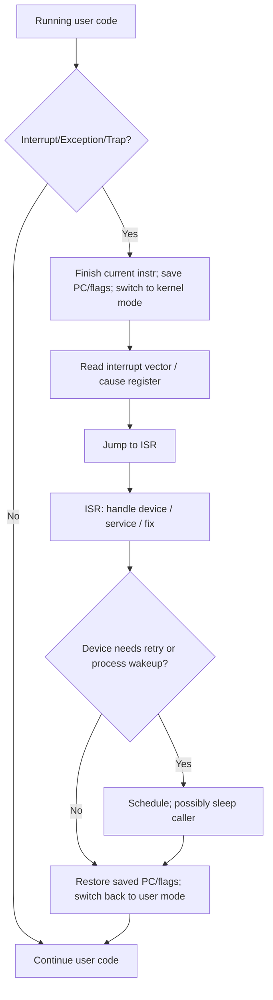

# Module 9: Interrupts and Exception Handling

[← Previous: Module 8](<Module-8.md>) · [Subject index](README.md) · [Next: Module 10 →](<Module-10.md>)

## Learning outcomes

After this module, you should be able to:

- distinguish traps, exceptions, and interrupts;
- explain user mode and kernel mode;
- describe how a computer responds to interrupts and events;
- relate interrupts to system calls;
- write and manage interrupt service routines (ISRs).

## Prerequisites

Complete [Module 8](Module-8.md) first. Review its quick-revision section if any term below feels unfamiliar.

## Study blocks

Study one block at a time. Work through its example and checkpoint before continuing.

| Block | Topic | Suggested time |
|---|---|---|
| 1 | Start here: the simple idea | 10-15 minutes |
| 2 | Types: Traps, Exceptions, Interrupts | 10-15 minutes |
| 3 | Handling non-deterministic events | 10-15 minutes |
| 4 | User mode and kernel mode | 10-15 minutes |
| 5 | How computers handle interrupts and events | 10-15 minutes |
| 6 | Interrupts and system calls | 10-15 minutes |
| 7 | Responding to the unexpected | 10-15 minutes |
| 8 | Writing and managing interrupt service routines (ISRs) | 10-15 minutes |

## Start here: the simple idea

An **interrupt** is an asynchronous (or semi-synchronous) signal that says
"stop what you're doing and handle this now." The CPU pauses, remembers enough
to resume, runs a small handler, and resumes. This lets the CPU wait for slow
devices (keyboard, disk) instead of busy-waiting.

### Everyday analogy

The CPU is a chef cooking a meal. A **timer interrupt** is the kitchen timer
ringing — the chef checks the clock and moves on. A **keyboard interrupt** is
a customer tapping the chef's shoulder to place an order. An **exception** is
the chef noticing the pan is smoking and switching to put it out immediately.

## Types: Traps, Exceptions, Interrupts

| Type | Trigger | Synchronous? | Who raises it |
|---|---|---|---|
| **Exception** | Instruction error (divide-by-zero, page fault, invalid opcode) | Yes | hardware/OS while executing |
| **Interrupt** | External device (keyboard, disk, timer) | No | I/O device/hardware |
| **Trap** | Software request (system call `syscall`/`int`) | Yes | the program itself |

### Exceptions (synchronous)

Generated by **executing a specific instruction**:

- **Fault:** recoverable, the faulting instruction is restarted after the handler
  (e.g. a page fault that succeeds in loading the page).
- **Trap:** reported *after* the instruction completes, then control returns to the
  next instruction (e.g. a system call via `int`/`svc`).
- **Abort:** unrecoverable; the program is terminated (e.g. a segmentation fault
  on an invalid address that cannot be loaded).

### Interrupts (asynchronous)

Generated **independently of the current instruction** by hardware:

- **Maskable (IRQ):** can be ignored/frozen for a while; the CPU checks a flag
  between instructions.
- **Non-maskable (NMI):** cannot be ignored; used for critical events (power loss).
- Edge-triggered vs level-triggered signalling on the pin.

### The interrupt vector

Each interrupt/exception is assigned a **vector**: an index into an
**interrupt vector table** that points to the handler address. The CPU saves
the current state and jumps to the right handler.

## Handling non-deterministic events

Non-deterministic = unpredictable *when* they arrive (e.g. a key press). The
design must be robust:

1. **Detect** via a hardware flag/pin.
2. **Interrupt acknowledge**: CPU finishes the current instruction, saves
   program status (PC, flags), and switches to **kernel/supervisor mode**.
3. **Dispatch**: index the vector table, jump to the **ISR** (interrupt service
   routine).
4. **Serve**: the ISR reads the device, does the work (often briefly), and may
   wake a waiting process.
5. **Return**: restore the saved state and resume the interrupted program at the
   next instruction.

### Nested and prioritized interrupts

- **Nesting:** while handling an ISR, a higher-priority interrupt can preempt it;
  the CPU stacks more state.
- **Priority:** devices are prioritized so urgent events (power fail) preempt
  routine ones (network packet).

## User mode and kernel mode

Modern CPUs have **protection rings** (x86: 0–3; ARM: EL0/EL1):

- **User mode (ring 3 / EL0):** limited; cannot execute I/O or privileged
  instructions. A privileged instruction or bad address raises an exception.
- **Kernel/supervisor mode (ring 0 / EL1):** full access to memory, I/O,
  and all instructions.

This separation protects the OS: a buggy user program cannot directly touch
hardware.

## How computers handle interrupts and events

## Interrupts and system calls

A **system call** is the program's polite way of requesting OS service. On
x86: `int 0x80`, or `syscall`/`sysenter`; on ARM: `svc #0`. This triggers a
**synchronous trap**:

1. Program prepares arguments (registers/stack).
2. Executes the syscall instruction.
3. CPU switches to kernel mode and jumps to the syscall handler (an OS entry).
4. The OS dispatches to the requested service (e.g., `read`, `write`, `fork`).
5. The OS returns the result and **returns to user mode**.

Note: a system call uses the same trap/exception hardware as faults — the
difference is *who* raised it (the program vs. the hardware).

## Responding to the unexpected

- **Polling** (busy-wait): CPU repeatedly checks a device flag = wastes CPU.
- **Interrupt-driven I/O:** device raises an interrupt when ready; CPU does
  useful work meanwhile. Much better for slow, unpredictable devices.
- **DMA (Direct Memory Access):** a controller transfers a whole block between
  device and memory without CPU intervention, then raises an interrupt when done.

## Writing and managing interrupt service routines (ISRs)

An ISR must be:

- **Fast:** do the minimum (e.g., read status, clear the interrupt source, queue
  data for later processing in a **top half** / deferred procedure call).
- **Reentrant / safe:** it can interrupt normal code and even itself; avoid
  blocking, avoid non-reentrant functions.
- **Correct about sources:** always clear the device's interrupt flag, or it will
  re-trigger immediately.

**Common ISR structure:**

1. Save registers the ISR will clobber (or use a dedicated IRQ stack).
2. Identify the device/cause.
3. Handle it (acknowledge, copy data, update state, wake a process).
4. Clear the interrupt source.
5. Restore saved state and return via an interrupt-return instruction (e.g.,
   `iret` on x86, `eret` on ARM).

**Managing ISRs:** register the handler in the vector table; mask/unmask the
IRQ line; set priorities; keep the top half (deferred work) separate.

## Common mistakes

- Doing long work inside the ISR (should defer to a tasklet/softirq).
- Forgetting to clear the device's interrupt flag (causes an interrupt storm).
- Using non-reentrant code or blocking inside an ISR.
- Confusing a synchronous trap (syscall) with an asynchronous hardware interrupt.

## Memory rules

- Exception: synchronous (instruction causes it), trap (post-completion), abort (fatal).
- Interrupt: asynchronous (external device); maskable vs non-maskable.
- User mode = restricted; kernel mode = full access.
- ISR = detect → save state → dispatch → serve → restore → return.
- System call = program-raised synchronous trap into the OS.

## Check your understanding

1. Which of the three types (exception/interrupt/trap) is synchronous, and which is asynchronous?
2. What is the difference between a fault and an abort?
3. Why switch to kernel mode before running an ISR?
4. How does a system call use the same hardware as a hardware interrupt?
5. Give two rules for writing ISRs.

## Answers

Reveal answers after attempting the questions

1. Trap and exception are synchronous (caused by/aware of the current instruction);
   hardware interrupts are asynchronous.
2. A fault is recoverable and restarts the offending instruction; an abort is
   unrecoverable and terminates the program.
3. To prevent the (possibly untrusted or buggy) user program from directly
   touching hardware/I/O and to keep the OS kernel protected.
4. Both save the current state, switch to kernel mode, index a vector table, and
   jump to a handler; a syscall is simply a trap deliberately raised by the program.
5. Keep ISRs fast and defer heavy work; always clear the device's interrupt flag,
   and avoid blocking/non-reentrant calls.

## Quick revision box

- Exception (synchronous, incl. page fault/segfault) vs interrupt (async, device) vs trap (syscall).
- Faults recover & restart; aborts kill the program.
- User mode = restricted; kernel mode = full privileges.
- ISR flow: save state → dispatch → serve → clear source → restore → return.
- System call = software trap into the OS; same vector/hw mechanism as interrupts.
- ISRs must be short, reentrant, and always clear the interrupt source.

## Exam guidance

Draw the relevant block or timing diagram, label data movement, show the calculation, and explain the performance consequence.

## Practice ladder

1. **Easy - Recall:** Define the module's central idea in one or two sentences.
2. **Easy - Recognize:** Identify the correct method for a small example and explain why it fits.
3. **Medium - Apply:** Work through one representative problem without copying the example.
4. **Medium - Compare:** Contrast two methods or concepts from the module.
5. **Hard - Integrate:** Solve a university-style scenario and justify every major step.

Reveal self-evaluation guide

A complete response uses correct terminology, shows intermediate steps, connects the result to the scenario, and states one assumption or limitation.

---

[← Previous: Module 8](<Module-8.md>) · [Subject index](README.md) · [Next: Module 10 →](<Module-10.md>)
