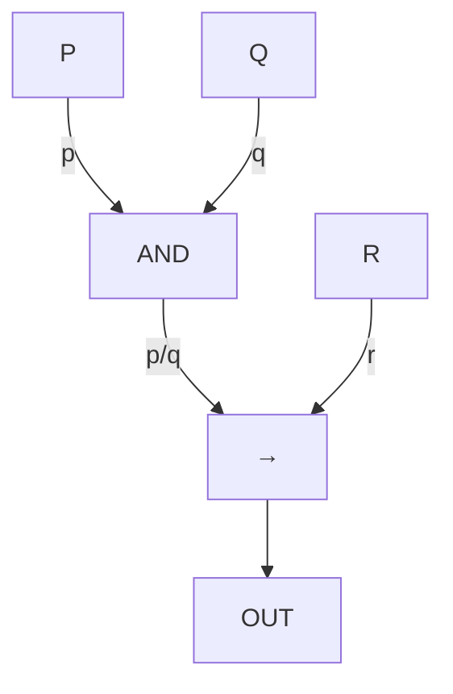

# Module 1 Article: How Logic Became the Language of Computing

## The big idea

Logic began as philosophy (Aristotle's syllogisms) but became the foundation of
**computing**: Boolean algebra became digital circuits, and type systems became
static checks that catch bugs before run time. The thread connecting them is the
idea that correct reasoning can be *mechanised*.

## From philosophy to circuits

- **Aristotle** formalised syllogisms ("All men are mortal; Socrates is a man;
  therefore Socrates is mortal"). This is the ancestor of predicate logic.
- **George Boole (1854)** turned logic into **algebra**: propositions are 0/1,
  AND is multiplication, OR is addition (mod 2).
- **Claude Shannon (1938)** recognised that Boole's 0/1 maps exactly to a relay
  switched off/on — so **Boolean algebra became circuit design**.
- **Alonzo Church / Alonzo-Turing** used logic to define what is *computable*;
  today's **type systems** are a descendant, proving programs safe before they run.

## Worked example: a tiny proof and its circuit

### Propositional proof

Prove `p → (q → r) ⊢ q → (p → r)` (this is one of the exercises in Module 1).

```text
1  p → (q → r)        premise
2  [q]                assume
3  [p]                assume
4  q → r              →-elim 1,3   (modus ponens)
5  r                  →-elim 4,2
6  p → r              →-intro 3–5
7  q → (p → r)        →-intro 2–6
```

### The same idea as a circuit

`(p ∧ q) → r` as a gate diagram:



`p ∧ q` (AND gate) then `→ r` (a gate that is OFF only when the AND is ON and r is OFF).
Boolean reasoning = reasoning about circuit behaviour.

## Soundness and completeness: what a proof system guarantees

A proof system is:

- **Sound:** everything provable is true (no false conclusions).
- **Complete:** everything true is provable (no missing truths).
- **Consistent:** it never proves `φ` and `¬φ` together.

| System | Sound? | Complete? |
|---|---|---|
| Propositional natural deduction | Yes | Yes |
| Predicate logic (first-order) | Yes | Yes (Gödel 1930) |
| Peano Arithmetic (PA) | Yes | **No** (Gödel's incompleteness) |

So propositional and first-order logic are "perfect" for reasoning, but theories
**about numbers** (like PA) inevitably have true statements they cannot prove.

## Boolean algebra in hardware

| Boolean | Gate |
|---|---|
| x ∧ y | AND |
| x ∨ y | OR |
| ¬x | NOT |
| x ⊕ y | XOR |

**Duality:** swap ∧↔∨, 0↔1, and every theorem stays true. This is why De Morgan's
laws come in mirrored pairs.

## Exam angle

For "relate Boolean algebra to digital circuits":

1. State Boole's correspondence (0/1 ↔ off/on).
2. Map AND→AND gate, OR→OR gate, NOT→NOT gate.
3. Give the duality principle and one consequence (De Morgan).
4. Mention Shannon's insight (circuits = Boolean algebra).

> Tip: examiners love the historical chain Boole → Shannon, and the triad
> sound/complete/consistent. Define each in one line.

## See also

- Module 4 (matrices): Boolean matrices and graph reachability.
- `Cheat-Sheet.md` for the natural-deduction rules and De Morgan laws.
