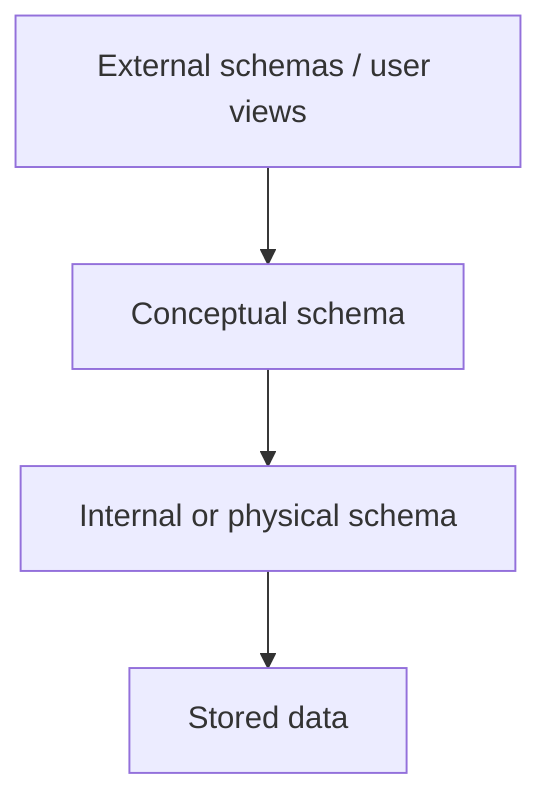

# Module 1: Introduction to Data Models

[↑ Semester I](../README.md) · [Subject index](README.md) · [Next: Module 2 →](<Module-2.md>)

## Learning outcomes

After this module, you should be able to explain the purpose and architecture of a DBMS, distinguish conceptual/logical/physical models, construct ER and EER diagrams, identify keys, and map an ER design to relations.


## Prerequisites

No earlier module is required. Start with the plain-English overview and review each unfamiliar term before continuing.

## Study blocks

Study one block at a time. Work through its example and checkpoint before continuing.

| Block | Topic | Suggested time |
|---|---|---|
| 1 | Start here: the simple idea | 10-15 minutes |
| 2 | Why this matters in practice | 10-15 minutes |
| 3 | Important terms explained simply | 10-15 minutes |
| 4 | 1. Database and DBMS | 10-15 minutes |
| 5 | 2. Three-schema architecture and data independence | 10-15 minutes |
| 6 | 3. Data modelling levels | 10-15 minutes |
| 7 | 4. ER model | 10-15 minutes |
| 8 | 5. Enhanced ER model | 10-15 minutes |
| 9 | 6. Keys and constraints | 10-15 minutes |
| 10 | 7. Mapping ER/EER to relations | 10-15 minutes |
| 11 | 8. Major data models | 10-15 minutes |


## Start here: the simple idea

Think of a database as a well-organized digital school cupboard:

- The **database** is the information inside it, such as student and marks records.
- The **DBMS** is the person managing the cupboard. It stores, finds, changes, protects, and restores the records.
- A **table** is like one register. A row is one record and a column is one type of detail.

For example, a `STUDENT` table may have the columns `StudentID`, `Name`, and `Email`.

### Three views of the same database

Imagine a school building:

1. **External view:** what one person sees. A student sees only their own marks.
2. **Conceptual view:** the complete plan of all students, courses, and marks.
3. **Internal view:** how the computer stores that information in files and indexes.

Changing the storage without changing the tables is **physical data independence**. Changing the table design with little or no change to user screens is **logical data independence**.

### ER model in plain language

An **ER diagram** is a picture made before creating database tables:

- **Entity:** a thing, such as `STUDENT` or `COURSE`.
- **Attribute:** a detail about it, such as `Name`.
- **Relationship:** a connection, such as “a student enrols in a course.”
- **Cardinality:** how many items can be connected: one-to-one, one-to-many, or many-to-many.
- **Key:** a value that identifies one record. `StudentID` is better than `Name` because two students can have the same name.

Keep this example in mind while reading the technical details below.

## Why this matters in practice

- In textbooks, this module explains how a real-world problem becomes a database model.
- In industry, the same ideas are used when planning tables, keys, and relationships before building an app.
- A useful mental model is: ER diagrams are the planning sketch, and tables are the final storage design.

## Important terms explained simply

### Primary key and foreign key

A **primary key** identifies one row. For example, `StudentID = 101` identifies one student even when two students have the same name.

A **foreign key** creates a connection to another table:

```text
STUDENT(StudentID, Name, DepartmentID)
DEPARTMENT(DepartmentID, DepartmentName)
```

`STUDENT.DepartmentID` points to `DEPARTMENT.DepartmentID`. Therefore it is a foreign key.

**Remember:** primary key means “Who am I?” Foreign key means “Whom am I connected to?”

### Candidate key and super key

Suppose both `StudentID` and `Email` are unique:

- Both are **candidate keys** because either one can identify a student using no unnecessary column.
- `(StudentID, Name)` is a **super key** because it is unique, but `Name` is unnecessary.

**Remember:** a candidate key is a minimal super key.

### Strong and weak entity

A `STUDENT` can exist using its own `StudentID`, so it is a **strong entity**. A student's `DEPENDENT` may only have a name and must use both `StudentID` and `DependentName` for identification, so it is a **weak entity**.

### Cardinality

- **1:1:** one person has one passport.
- **1:M:** one department has many students.
- **M:N:** many students study many courses.

An M:N relationship needs a connecting table such as `ENROLLMENT`.

## 1. Database and DBMS

A **database** is an organized collection of related data. A **Database Management System (DBMS)** is software that defines, creates, stores, queries, updates, secures, and recovers that data. A database system includes the data, DBMS, applications, users, and hardware.

### Why use a DBMS?

- Controlled redundancy and improved consistency
- Data sharing with concurrent access
- Integrity constraints and security
- Backup and recovery
- Data independence
- Multiple user views and standard query languages

Traditional file systems often duplicate data, isolate it across files, tightly couple programs to file formats, and provide weak concurrency and recovery. A DBMS adds management overhead and cost, so a simple file may still suit very small, single-user, short-lived data.

### DBMS users

- **DBA:** security, authorization, backup, tuning, and availability
- **Database designer:** models data and constraints
- **Application developer:** builds programs that access the database
- **End user:** performs routine or ad-hoc operations

## 2. Three-schema architecture and data independence



- **External level:** each user's view of relevant data.
- **Conceptual level:** complete logical structure of the database.
- **Internal level:** files, pages, indexes, partitions, and access paths.

**Physical data independence** means storage changes, such as adding an index, do not require changes to the logical schema. **Logical data independence** means logical changes have minimal effect on user views and applications. Logical independence is harder to achieve.

## 3. Data modelling levels

| Model | Main concern | Typical output |
|---|---|---|
| Conceptual | Business objects and rules | ER diagram |
| Logical | Relations, attributes, keys, constraints | Relational schema |
| Physical | DBMS-specific storage and performance | Tablespaces, indexes, partitions |

Good modelling begins with requirements, builds a conceptual model, converts it to a logical model, validates it, and then creates a physical design.

## 4. ER model

### Building blocks

- **Entity:** distinguishable real-world object, e.g. a student.
- **Entity type/set:** collection of similar entities, e.g. `STUDENT`.
- **Attribute:** property such as `Name`.
- **Relationship:** association such as STUDENT *enrols in* COURSE.

Attribute types include simple/composite (`Address` → street, city), single-valued/multivalued (`Phone`), stored/derived (`Age` derived from date of birth), and key/non-key.

### Cardinality and participation

| Constraint | Meaning | Example |
|---|---|---|
| 1:1 | At most one on each side | Person–Passport |
| 1:M | One parent, many children | Department–Employee |
| M:N | Many on both sides | Student–Course |

**Total participation** means every entity must participate; **partial participation** means participation is optional. Minimum-maximum notation such as `(0, N)` states both participation and cardinality.

### Weak entity

A weak entity has no complete key of its own and depends on an owner entity. Its **partial key** distinguishes weak entities belonging to the same owner. For example, `DEPENDENT(Name, Age)` owned by `EMPLOYEE(EmployeeID)` has key `(EmployeeID, Name)`.

## 5. Enhanced ER model

- **Specialization:** top-down division of a superclass, e.g. EMPLOYEE into FACULTY and ADMIN.
- **Generalization:** bottom-up combination of similar entity types.
- **Inheritance:** subclasses inherit superclass attributes and relationships.
- **Disjoint constraint:** an entity can belong to only one subclass.
- **Overlapping constraint:** it can belong to several subclasses.
- **Total specialization:** every superclass entity is in a subclass.
- **Aggregation:** treats a relationship as a higher-level entity so it can participate in another relationship.

## 6. Keys and constraints

| Key | Meaning |
|---|---|
| Super key | Any attribute set that uniquely identifies a tuple |
| Candidate key | Minimal super key; no attribute can be removed |
| Primary key | Candidate key chosen as the main identifier |
| Alternate key | Candidate key not chosen as primary |
| Composite key | Key containing more than one attribute |
| Foreign key | Attribute(s) referencing a candidate/primary key elsewhere |

If both `StudentID` and `Email` are unique, `{StudentID}`, `{Email}`, and `{StudentID, Name}` are super keys; the first two are candidate keys, but the last is not minimal.

**Entity integrity:** a primary-key value cannot be null. **Referential integrity:** a foreign key must match a referenced key value or be null when null is permitted. Domain constraints restrict values by type, range, or format.

## 7. Mapping ER/EER to relations

1. **Strong entity:** create one table containing simple attributes; choose its key.
2. **Composite attribute:** store its components, not the combined attribute.
3. **Multivalued attribute:** create a separate table with the owner's key and the value.
4. **Weak entity:** create a table containing its partial key and owner key; combine them as primary key.
5. **1:1 relationship:** place a foreign key on the total-participation side; add `UNIQUE`.
6. **1:M relationship:** put the key of the 1-side as a foreign key on the M-side.
7. **M:N relationship:** create a junction table containing both keys and relationship attributes.
8. **n-ary relationship:** create a relation containing the keys of all participating entity types.

Example:

```sql
CREATE TABLE Enrollment (
    StudentID INT,
    CourseID  INT,
    Semester  VARCHAR(10),
    Marks     DECIMAL(5,2),
    PRIMARY KEY (StudentID, CourseID, Semester),
    FOREIGN KEY (StudentID) REFERENCES Student(StudentID),
    FOREIGN KEY (CourseID)  REFERENCES Course(CourseID),
    CHECK (Marks BETWEEN 0 AND 100)
);
```

Superclass/subclass mapping may use one table for the hierarchy (with a type column), one superclass plus one table per subclass, or one table per concrete subclass. The choice trades simplicity, null values, and join cost.

## 8. Major data models

| Model | Structure | Strength | Limitation |
|---|---|---|---|
| Relational | Tables | Simplicity, SQL, integrity | Object-relational mismatch |
| Hierarchical | Tree | Fast parent-child navigation | Poor M:N support |
| Network | Graph/records and sets | Flexible links | Complex navigation |
| Object-oriented | Persistent objects | Supports identity and inheritance | Less universal tooling |

## Exam focus

- Never confuse a database with a DBMS.
- State both cardinality and participation in ER answers.
- Candidate key means *minimal*, not merely unique.
- An M:N relationship always needs a new relation in relational mapping.

## Common mistakes

- Using a person's name as a reliable primary key
- Confusing an entity with one row representing that entity
- Showing cardinality but forgetting optional or total participation
- Placing an M:N relationship directly into one table without a junction table

## Memory rules

- Primary key asks, “Who am I?”
- Foreign key asks, “Whom am I connected to?”
- Entity is a thing; attribute is its detail.
- One-to-many places the 1-side key on the many side.

## Self-check

1. Explain logical and physical data independence with examples.
2. Draw an ER model for a library with books, members, and loans.
3. Map a weak entity and an M:N relationship to relations.
4. Distinguish specialization from generalization.

## Answers

<details>
<summary>Reveal answers after attempting the questions</summary>

1. Physical independence lets storage change without changing tables; logical independence protects user views when the logical design changes.
2. Use `MEMBER`, `BOOK`, and `LOAN`. A member can have many loans, and a book can appear in many loans over time.
3. Put the owner's key inside the weak table. Map an M:N relationship to a junction table containing both entity keys.
4. Specialization splits one broad entity into smaller subtypes. Generalization combines similar entities into one broader type.

</details>

## Quick revision box

- Database = organized data; DBMS = software that manages it.
- Entity = thing; attribute = detail; relationship = connection.
- Primary key identifies a row; foreign key connects tables.
- A 1:M relationship places the 1-side key on the M-side.
- An M:N relationship requires a junction table.

## Practice ladder

1. **Easy - Recall:** Define the module's central idea in one or two sentences.
2. **Easy - Recognize:** Identify the correct method for a small example and explain why it fits.
3. **Medium - Apply:** Work through one representative problem without copying the example.
4. **Medium - Compare:** Contrast two methods or concepts from the module.
5. **Hard - Integrate:** Solve a university-style scenario and justify every major step.

<details>
<summary>Reveal self-evaluation guide</summary>

A complete response uses correct terminology, shows intermediate steps, connects the result to the scenario, and states one assumption or limitation.

</details>

---

[↑ Semester I](../README.md) · [Subject index](README.md) · [Next: Module 2 →](<Module-2.md>)
