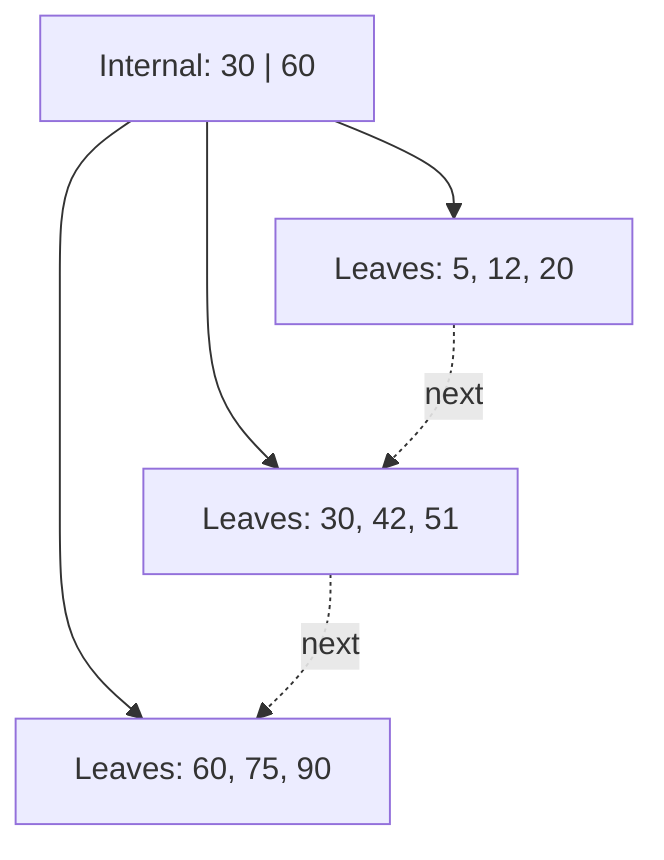

# Module 6: Indexing and Hashing

[← Previous: Module 5](<Module-5.md>) · [Subject index](README.md) · [Next: Module 7 →](<Module-7.md>)

## Learning outcomes

After completing this module, you should be able to:

- explain the central ideas in **Module 6: Indexing and Hashing** using simple language;
- apply the main method or rules to a worked example;
- connect the topic to a practical computing scenario; and
- answer short and long university questions with clear steps.


## Prerequisites

Complete [Module 5](Module-5.md) first. Review its quick-revision section if any term below feels unfamiliar.

## Study blocks

Study one block at a time. Work through its example and checkpoint before continuing.

| Block | Topic | Suggested time |
|---|---|---|
| 1 | Start here: the simple idea | 10-15 minutes |
| 2 | Why this matters in practice | 10-15 minutes |
| 3 | Difficult terms explained simply | 10-15 minutes |
| 4 | 1. Storage basics | 10-15 minutes |
| 5 | 2. Index classifications | 10-15 minutes |
| 6 | 3. B-tree and B+ tree | 10-15 minutes |
| 7 | 4. Hashing | 10-15 minutes |
| 8 | 5. B+ tree versus hashing | 10-15 minutes |
| 9 | 6. Index selection examples | 10-15 minutes |


## Start here: the simple idea

An index in a database works like the index at the back of a textbook. Without it, you may check every page. With it, you find a topic and jump to the correct page.

The database stores records in fixed-size pieces called **pages** or **blocks**. Reading fewer pages usually makes a query faster.

### Two important index ideas

- **B+ tree:** like a sorted school directory. It is good for exact searches and ranges such as marks from 70 to 90.
- **Hash index:** like numbered lockers chosen by a formula. It is usually very fast for an exact match, but poor for a range because nearby values may go to different lockers.

An index has a cost: it needs storage and must be updated whenever data changes. Therefore, indexing every column can make writing slower.

### Easy comparison

| Need | Better choice |
|---|---|
| `Email = 'a@x.com'` | Hash or B+ tree |
| `Marks BETWEEN 70 AND 90` | B+ tree |
| Results in sorted order | B+ tree |
| Very frequent exact lookup | Hash often helps |

A **search key** is simply the column used by an index. It does not have to be the table's primary key or even be unique.

## Why this matters in practice

- In textbooks, indexing is taught as a way to reduce search work.
- In industry, indexes support login lookups, report filters, joins, and search-heavy screens.
- The tradeoff is always the same: faster reads often mean more work when data is inserted or updated.

## Difficult terms explained simply

### Dense and sparse index

- A **dense index** has an entry for every record or search-key value. It is larger but gives direct access.
- A **sparse index** has entries for only some values or pages. It is smaller, but the data must be ordered so the DBMS can continue searching from the nearest entry.

### Clustered and non-clustered index

A **clustered index** keeps table rows in or close to the index order, like arranging students physically by roll number. A **non-clustered index** is a separate list containing directions to the rows, like a textbook index pointing to page numbers.

### B+ tree split

When a B+ tree node becomes full, it is divided into two nodes. A separator is added to the parent. The tree stays balanced, so every search needs roughly the same small number of levels.

### Hash collision

A **collision** happens when two different keys are sent to the same bucket. The database keeps an overflow area or another structure to store both.

### Composite index

An index on `(DepartmentID, AdmissionDate)` is arranged first by department and then by date inside each department. It usually helps searches by department, but may not efficiently help a search using only admission date.

## 1. Storage basics

Disk/SSD data is transferred in fixed-size **pages (blocks)**. A file contains records stored across pages. Because reading pages is far more expensive than comparing values in memory, index design aims to reduce page I/O.

An **index** is an auxiliary structure mapping a search-key value to the location of matching records. A search key need not be unique and need not be a candidate key.

Benefits:

- Faster equality, range, join, grouping, and ordering operations
- Possible index-only queries when required columns are present

Costs:

- Extra storage
- Additional work on insert, update, and delete
- Fragmentation and maintenance

Indexes should serve frequent, selective queries. Indexing a tiny table or a low-selectivity column such as a Boolean may not help.

## 2. Index classifications

### Clustered and non-clustered

- A **clustered index** determines or closely matches physical row order. A table can normally have only one physical ordering. It is excellent for ranges but inserts may cause page splits.
- A **non-clustered index** is a separate structure containing keys and row locators. A table can have several.

Terminology varies among DBMS products; some use “index-organized,” “clustered table,” or clustered primary index.

### Primary, clustering, and secondary

In textbook terminology:

- **Primary index:** ordered data file and ordering field is a key.
- **Clustering index:** ordered file and ordering field is non-key.
- **Secondary index:** index order differs from physical file order.

### Dense and sparse

- **Dense index:** one entry for every search-key value or record; fast but larger.
- **Sparse index:** entries for selected values/pages; smaller but requires the data file to be ordered.

### Composite and covering indexes

An index on `(DepartmentID, AdmissionDate)` follows the **leftmost-prefix** principle in B-tree systems: it can efficiently support `DepartmentID` alone or both columns, but often not `AdmissionDate` alone.

A **covering index** contains all columns needed by a query, avoiding base-table lookup. Column order should consider equality predicates, range predicates, sorting, and selectivity.

## 3. B-tree and B+ tree

A balanced search tree keeps every leaf at the same depth, so search, insertion, and deletion are logarithmic in the number of entries.

In a **B+ tree**:

- Internal nodes store separator keys and child pointers.
- Leaf nodes store all search keys and record pointers.
- Leaves are linked in sorted order.
- Nodes are kept at least approximately half full, except possibly the root.



If an internal node can contain at most `p` child pointers, `p` is its **order/fan-out**. Large fan-out gives a small height, often only 3–4 levels for large databases.

### Search

1. Start at root.
2. Compare the search key with separators.
3. Follow the correct child pointer.
4. Repeat to a leaf and locate the entry.

### Insertion

Insert in the correct leaf. If the node overflows, split it and copy/promote a separator to its parent. Splitting can propagate to the root; a root split increases height.

### Deletion

Delete the entry. If underflow occurs, borrow from a sibling or merge nodes and update the parent. Root merging can reduce height.

B+ trees support both equality and range search efficiently because leaves are ordered and linked. In contrast, a B-tree may store data pointers in internal and leaf nodes.

## 4. Hashing

A hash function maps a search key to a **bucket**:

```text
bucket = h(search_key)
```

Hashing provides expected near-constant-time equality lookup but is poor for ordered traversal and range queries because adjacent key values need not be in adjacent buckets.

### Collisions

A collision occurs when distinct keys map to the same bucket. Techniques include:

- Separate chaining/overflow pages
- Open addressing (mainly in memory): linear probing, quadratic probing, double hashing

A good hash function distributes keys uniformly. The **load factor** measures how full the structure is; excessive load increases collisions.

### Static and dynamic hashing

Static hashing has a fixed bucket count and develops long overflow chains as data grows.

**Extendible hashing** uses a directory indexed by leading/trailing hash bits:

- Global depth: bits used by the directory
- Local depth: bits distinguishing a bucket
- On overflow, split the bucket; double the directory when needed

**Linear hashing** grows gradually without a directory, splitting buckets in a controlled round.

## 5. B+ tree versus hashing

| Requirement | B+ tree | Hash index |
|---|---|---|
| Equality search | Very good | Usually best |
| Range search | Excellent | Poor |
| Sorted output | Supported | Not supported |
| Prefix search (`LIKE 'abc%'`) | Often useful | Usually not |
| Growth | Balanced splits | Dynamic scheme or rehashing |

## 6. Index selection examples

```sql
CREATE INDEX idx_student_dept_date
ON Student(DepartmentID, AdmissionDate);

CREATE UNIQUE INDEX idx_student_email
ON Student(Email);
```

Avoid redundant indexes and verify use with `EXPLAIN`. An index may be ignored when a query returns a large fraction of the table, applies an unsupported function to the indexed column, uses an incompatible data conversion, or statistics are inaccurate.

## Exam focus

- Differentiate search key from primary key.
- Draw linked leaf nodes in a B+ tree.
- Explain why hashing is fast for equality but unsuitable for ranges.
- Include both read benefits and update/storage costs of indexing.

## Common mistakes

- Assuming every search key is unique
- Expecting a hash index to return sorted or ranged results
- Ignoring the write and storage cost of an index
- Assuming a composite index efficiently supports every individual column

## Memory rules

- B+ tree = ordered road map.
- Hash index = direct bucket lookup.
- Dense means many entries; sparse means selected entries.
- Clustered describes row order; non-clustered stores separate directions.

## Check your understanding

1. Which index suits `Marks BETWEEN 70 AND 90`?
2. Why can a table normally have only one clustered order?
3. What happens when a B+ tree node becomes full?

## Answers

<details>
<summary>Reveal answers after attempting the questions</summary>

1. A B+ tree index because it preserves key order.
2. Rows can have only one physical ordering at a time.
3. The node splits, and a separator is copied or promoted to its parent.

</details>

## Quick revision box

Choose an index from actual query needs. B+ trees support equality, ranges, and order; hashing mainly supports exact matches.

## Practice ladder

1. **Easy - Recall:** Define the module's central idea in one or two sentences.
2. **Easy - Recognize:** Identify the correct method for a small example and explain why it fits.
3. **Medium - Apply:** Work through one representative problem without copying the example.
4. **Medium - Compare:** Contrast two methods or concepts from the module.
5. **Hard - Integrate:** Solve a university-style scenario and justify every major step.

<details>
<summary>Reveal self-evaluation guide</summary>

A complete response uses correct terminology, shows intermediate steps, connects the result to the scenario, and states one assumption or limitation.

</details>

---

[← Previous: Module 5](<Module-5.md>) · [Subject index](README.md) · [Next: Module 7 →](<Module-7.md>)
