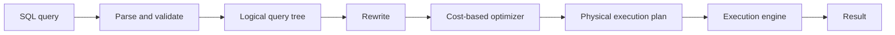

# Module 7: Query Processing and Optimization

[← Previous: Module 6](<Module-6.md>) · [Subject index](README.md) · [Next: Module 8 →](<Module-8.md>)

## Learning outcomes

After completing this module, you should be able to:

- explain the central ideas in **Module 7: Query Processing and Optimization** using simple language;
- apply the main method or rules to a worked example;
- connect the topic to a practical computing scenario; and
- answer short and long university questions with clear steps.


## Prerequisites

Complete [Module 6](Module-6.md) first. Review its quick-revision section if any term below feels unfamiliar.

## Study blocks

Study one block at a time. Work through its example and checkpoint before continuing.

| Block | Topic | Suggested time |
|---|---|---|
| 1 | Start here: the simple idea | 10-15 minutes |
| 2 | Why this matters in practice | 10-15 minutes |
| 3 | Query-plan terms explained simply | 10-15 minutes |
| 4 | 1. Query-processing pipeline | 10-15 minutes |
| 5 | 2. Query cost | 10-15 minutes |
| 6 | 3. Physical operators | 10-15 minutes |
| 7 | 4. Heuristic optimization | 10-15 minutes |
| 8 | 5. Cost-based optimization | 10-15 minutes |
| 9 | 6. Reading an execution plan | 10-15 minutes |
| 10 | 7. Materialized views and query rewrite | 10-15 minutes |
| 11 | 8. Practical tuning sequence | 10-15 minutes |


## Start here: the simple idea

When we send SQL, the DBMS behaves like a smart trip planner:

1. It checks whether the request is written correctly.
2. It lists possible ways to get the answer.
3. It estimates the cost of each way.
4. It chooses a low-cost plan and runs it.

The SQL query says **what** we want. The execution plan says **how** the DBMS will find it.

### Words to understand first

- **Cardinality:** estimated number of rows.
- **Selectivity:** how strongly a condition reduces rows. Finding one student by ID is highly selective.
- **Table scan:** read the whole table.
- **Index scan:** use an index to reach selected rows.
- **Join algorithm:** method used to connect tables.
- **Query cost:** estimated work involving storage, CPU, memory, and sometimes network use.

## Why this matters in practice

- In textbooks, query processing explains why some queries are fast and others are slow.
- In industry, it matters whenever an app filters, joins, sorts, or reports over large tables.
- For beginners, the main lesson is that a correct query and a fast query are not always the same thing.

A full table scan is not always bad. If a query needs most rows, reading the table once may be faster than making thousands of index visits.

The most useful optimization idea is: reduce unnecessary data early. For example, filter CS students before joining them with millions of enrolment rows. `EXPLAIN` shows the chosen plan; actual measurements are more trustworthy than guessing.

## Query-plan terms explained simply

### Parser, optimizer, and executor

- **Parser:** checks SQL grammar, like a language teacher.
- **Optimizer:** compares possible methods and chooses a low-cost plan, like a route planner.
- **Executor:** performs the chosen plan.

### Cardinality and selectivity example

A table has 10,000 students. A condition returns 100 CS students:

```text
Cardinality = 100 rows
Selectivity = 100 / 10,000 = 1%
```

Low percentage means the condition is highly selective, so an index may help.

### Join methods

- **Nested-loop join:** for every row in one table, look for matches in another; useful when the first input is small.
- **Hash join:** place one input into hash buckets, then search those buckets; useful for large equality joins.
- **Sort-merge join:** sort both inputs and walk through them together; useful when order is already available or needed.

### Pipelining and materializing

**Pipelining** passes rows directly to the next operation. **Materializing** stores an intermediate result before continuing. Pipelining can save time and storage, but operations such as a full sort may need materialization.

## 1. Query-processing pipeline



1. **Parser** checks syntax and creates a parse tree.
2. **Semantic analysis** resolves tables, columns, types, and privileges.
3. **Rewrite** expands views and applies rule-based transformations.
4. **Optimizer** compares equivalent physical plans.
5. **Executor** runs the chosen operators using the buffer manager and storage engine.

SQL states what is wanted; the plan states how it is obtained.

## 2. Query cost

Cost estimates may include:

- Disk page reads/writes (dominant in traditional models)
- CPU comparisons and hashing
- Memory required and temporary spill I/O
- Network transfer in distributed systems
- Response time versus total throughput

The optimizer estimates **cardinality** (number of result rows) and **selectivity** (fraction of input rows retained). It uses table size, distinct-value counts, null fractions, histograms, index metadata, and sometimes correlations.

Uniform-distribution and independence assumptions can be wrong. Stale statistics, skewed values, or correlated predicates cause cardinality errors, which can lead to a poor join order or algorithm.

## 3. Physical operators

### Table and index access

- **Sequential/table scan:** reads the whole table; good when many rows are needed.
- **Index scan/seek:** finds selected rows through an index; good for selective predicates.
- **Index-only scan:** obtains all required data from the index.

### Join algorithms

| Algorithm | Suitable situation |
|---|---|
| Nested-loop join | Small outer input; index on inner join key |
| Block nested-loop | Uses memory blocks to reduce repeated scans |
| Sort-merge join | Sorted inputs, range/equality join, reusable order |
| Hash join | Large unsorted inputs with an equality condition |

For a simple nested loop, roughly every outer tuple may scan the inner relation. An indexed nested loop replaces that scan with index probes. Hash join builds a hash table on the smaller input and probes it with the larger input; if memory is insufficient, partitions may spill to disk.

### Other operators

Selection, projection, sorting, duplicate removal, grouping, and aggregation can be **pipelined** or **materialized**. A blocking operator such as a full sort must consume substantial input before producing output.

## 4. Heuristic optimization

Common transformations:

- Push selections close to base relations.
- Push projections while retaining join and output columns.
- Replace Cartesian product plus selection with a join.
- Perform the most selective operations early.
- Reorder inner joins to minimize intermediate results.
- Combine compatible scans/operations.

Example:

```text
σ Student.Dept='CS'(STUDENT ⋈ ENROLL)
```

can become:

```text
(σ Dept='CS'(STUDENT)) ⋈ ENROLL
```

This reduces the left input before the join. Such transformations must preserve semantics; outer joins, nulls, and nondeterministic expressions restrict safe reordering.

## 5. Cost-based optimization

The optimizer enumerates possible join orders, access paths, and operator implementations and chooses the lowest estimated cost. Exhaustive enumeration is expensive, so systems use dynamic programming, pruning, heuristics, or randomized search.

For `n` joined tables, the number of possible join orders grows rapidly. **Left-deep plans** are common because their intermediate result can pipeline into the next join. Bushy plans may benefit parallel execution.

## 6. Reading an execution plan

```sql
EXPLAIN
SELECT s.Name, AVG(e.Marks)
FROM Student s
JOIN Enrollment e ON e.StudentID = s.StudentID
WHERE s.DepartmentID = 10
GROUP BY s.StudentID, s.Name;
```

Look for:

- Scan type and indexes used
- Estimated versus actual row counts (`EXPLAIN ANALYZE` where supported)
- Join type and join order
- Sort/hash operations and spills
- Filters applied late
- Highest-cost operators

`EXPLAIN ANALYZE` executes the statement, so use care with slow or data-changing statements and product-specific behavior.

## 7. Materialized views and query rewrite

A materialized view physically stores a query result, such as daily department totals. The optimizer may rewrite a compatible query to use it.

Refresh choices:

- Complete refresh: recompute all data
- Incremental/fast refresh: apply only changes
- On commit: fresh but increases write cost
- On demand/schedule: cheaper writes but permits staleness

Use materialized views for stable, repeated, expensive aggregations or joins. Ordinary views store only the query definition.

## 8. Practical tuning sequence

1. Measure the slow query and inspect its actual plan.
2. Check correctness and whether unnecessary rows/columns are requested.
3. Ensure statistics are current.
4. Add or adjust a selective/composite index when justified.
5. Rewrite non-sargable predicates (predicates that cannot use an index effectively).
6. Address join order/cardinality problems.
7. consider partitioning, caching, or materialized views for proven workloads.
8. measure again; do not optimize by guesswork.

## Exam focus

- Query optimization selects a low estimated cost, not guaranteed absolute best.
- Explain cardinality because it drives most plan choices.
- Compare logical query trees with physical plans.
- A full scan is not automatically bad; it may be optimal for large result fractions.

## Common mistakes

- Believing an index scan is always faster than a table scan
- Treating estimated cost as exact execution time
- Ignoring incorrect cardinality estimates
- Optimizing before measuring the actual query plan

## Memory rules

- SQL says what; the plan says how.
- Cardinality counts rows; selectivity measures the retained fraction.
- Filter early when semantics allow it.
- Measure, change, and measure again.

## Check your understanding

1. Why might the optimizer choose a full scan?
2. Which join commonly suits a large equality join?
3. What does `EXPLAIN` show?

## Answers

<details>
<summary>Reveal answers after attempting the questions</summary>

1. A full scan can be cheaper when the query needs a large part of the table.
2. A hash join commonly suits large, unsorted equality joins.
3. It shows the chosen execution plan and estimated operations.

</details>

## Quick revision box

The optimizer compares access paths, join orders, and physical operators. Good statistics are essential because row estimates influence most choices.

## Practice ladder

1. **Easy - Recall:** Define the module's central idea in one or two sentences.
2. **Easy - Recognize:** Identify the correct method for a small example and explain why it fits.
3. **Medium - Apply:** Work through one representative problem without copying the example.
4. **Medium - Compare:** Contrast two methods or concepts from the module.
5. **Hard - Integrate:** Solve a university-style scenario and justify every major step.

<details>
<summary>Reveal self-evaluation guide</summary>

A complete response uses correct terminology, shows intermediate steps, connects the result to the scenario, and states one assumption or limitation.

</details>

---

[← Previous: Module 6](<Module-6.md>) · [Subject index](README.md) · [Next: Module 8 →](<Module-8.md>)
