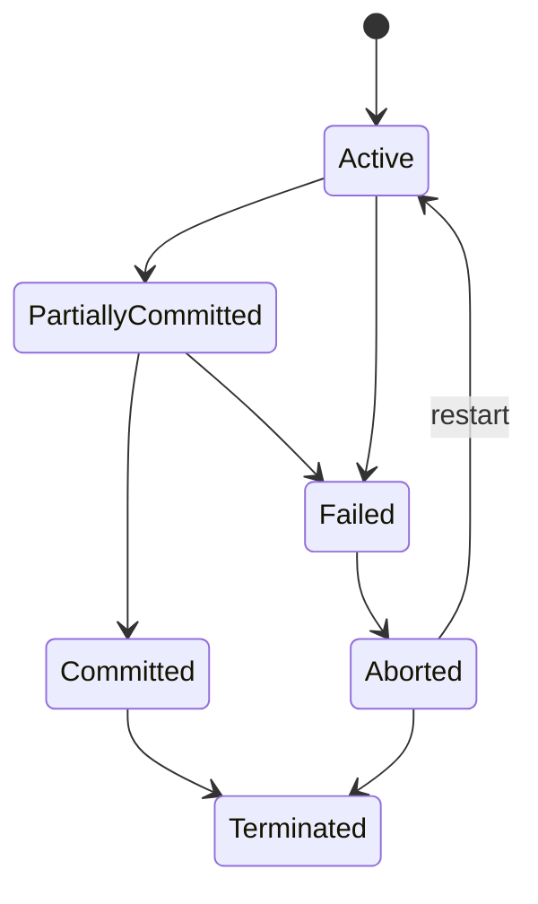

# Module 8: Transaction Management

[← Previous: Module 7](<Module-7.md>) · [Subject index](README.md) · [Next: Module 9 →](<Module-9.md>)

## Learning outcomes

After completing this module, you should be able to:

- explain the central ideas in **Module 8: Transaction Management** using simple language;
- apply the main method or rules to a worked example;
- connect the topic to a practical computing scenario; and
- answer short and long university questions with clear steps.


## Prerequisites

Complete [Module 7](Module-7.md) first. Review its quick-revision section if any term below feels unfamiliar.

## Study blocks

Study one block at a time. Work through its example and checkpoint before continuing.

| Block | Topic | Suggested time |
|---|---|---|
| 1 | Start here: the simple idea | 10-15 minutes |
| 2 | Why this matters in practice | 10-15 minutes |
| 3 | Difficult transaction ideas explained simply | 10-15 minutes |
| 4 | 1. Transaction concept | 10-15 minutes |
| 5 | 2. ACID properties | 10-15 minutes |
| 6 | 3. Transaction states | 10-15 minutes |
| 7 | 4. Schedules and conflicts | 10-15 minutes |
| 8 | 5. Conflict serializability | 10-15 minutes |
| 9 | 6. View serializability | 10-15 minutes |
| 10 | 7. Recoverability | 10-15 minutes |
| 11 | 8. Isolation anomalies and levels | 10-15 minutes |
| 12 | 9. Recovery and logging | 10-15 minutes |


## Start here: the simple idea

A **transaction** is a group of database actions treated as one complete job. In a bank transfer, subtracting money from one account and adding it to another must both happen. Saving only half would be wrong.

### ACID using the bank example

- **Atomicity:** both account changes happen, or neither happens.
- **Consistency:** rules remain true; money is not created or lost.
- **Isolation:** simultaneous transfers do not incorrectly disturb each other.
- **Durability:** after success is confirmed, the transfer survives a crash.

### Other key ideas

- A **schedule** is the order in which actions from several transactions are mixed.
- A **serial schedule** finishes one transaction before starting another.
- **Serializability** means a mixed schedule gives the same correct effect as some serial schedule.
- **Recoverability** means transactions commit in a safe order so failed work can be undone.
- A **log** is a history used to undo unfinished work or redo committed work after a crash.

## Why this matters in practice

- In textbooks, transactions show how database correctness is preserved.
- In industry, these ideas protect money transfers, bookings, inventory updates, and other multi-step changes.
- For beginners, remember the simple rule: a transaction must behave like one reliable job, even when many users are active.

Remember: `COMMIT` means “make it permanent,” while `ROLLBACK` means “cancel the changes.” A **savepoint** is a checkpoint inside a transaction to which we can partly roll back.

## Difficult transaction ideas explained simply

### Conflict

Two operations conflict when they belong to different transactions, use the same item, and at least one changes it:

- Read and read: no conflict.
- Read and write: conflict.
- Write and write: conflict.

### Precedence graph

Draw one circle for each transaction. If `T1` performs a conflicting action before `T2`, draw `T1 -> T2`. No cycle means the schedule is conflict-serializable. A cycle such as `T1 -> T2 -> T1` means it is not.

### Dirty read, lost update, and phantom

- **Dirty read:** reading another transaction's unsaved value.
- **Lost update:** one person's write overwrites another person's write.
- **Phantom:** repeating a search produces extra or missing rows because another transaction inserted or deleted matching rows.

### UNDO, REDO, and WAL

- **UNDO:** remove changes made by a transaction that did not commit.
- **REDO:** apply committed changes again after a crash.
- **Write-ahead logging (WAL):** write the safety record to the log before writing the changed database page.

**Remember:** the log is the database's recovery diary.

## 1. Transaction concept

A **transaction** is a logical unit of database work that must complete consistently. A bank transfer contains a debit and matching credit:

```text
BEGIN → read A → A=A−500 → write A
      → read B → B=B+500 → write B → COMMIT
```

If the system fails between the writes, recovery must undo or complete work according to commit status.

## 2. ACID properties

- **Atomicity:** all operations occur or none do.
- **Consistency:** a correct transaction takes the database from one valid state to another; constraints and application logic define validity.
- **Isolation:** concurrent execution appears equivalent to an allowed serial execution at the promised isolation level.
- **Durability:** committed changes survive failures.

Atomicity and durability are largely implemented through recovery/logging; isolation through concurrency control; consistency is a joint responsibility of schema constraints, transactions, and applications.

## 3. Transaction states



- **Active:** executing
- **Partially committed:** last statement completed but commit not yet durable
- **Committed:** success recorded durably
- **Failed:** cannot proceed
- **Aborted:** effects rolled back

## 4. Schedules and conflicts

A **schedule** interleaves operations of transactions while preserving the internal order of each. A serial schedule runs one complete transaction at a time. Concurrent schedules improve throughput but can create anomalies.

Two operations conflict if they:

1. belong to different transactions,
2. access the same data item, and
3. at least one is a write.

Thus `R-R` does not conflict; `R-W`, `W-R`, and `W-W` do.

## 5. Conflict serializability

A schedule is conflict-serializable if it is conflict-equivalent to a serial schedule.

### Precedence graph test

1. Create one node per transaction.
2. For each conflicting pair on the same item, add edge `Ti → Tj` when Ti's operation occurs first.
3. The schedule is conflict-serializable exactly when the graph is acyclic.
4. A topological ordering gives an equivalent serial order.

Example:

```text
R1(X), W1(X), R2(X), W2(X)
```

creates `T1 → T2` and is serializable as T1 then T2. If another item creates `T2 → T1`, the cycle makes it non-serializable.

## 6. View serializability

Two schedules are view-equivalent if:

- Each read obtains its value from the same transaction (or initial value).
- The same transaction performs the final write on each item.

View serializability is broader than conflict serializability because it can accept schedules with **blind writes**. Testing it is computationally harder, so practical systems mainly enforce conflict-serializable behavior or snapshot-based guarantees.

## 7. Recoverability

- **Recoverable schedule:** if Tj reads data written by Ti, Tj commits only after Ti commits.
- **Cascadeless schedule:** transactions read only committed values, preventing cascading rollback.
- **Strict schedule:** no transaction may read or write an item written by an uncommitted transaction.

```text
Strict ⇒ Cascadeless ⇒ Recoverable
```

Strict schedules simplify recovery and are commonly sought.

## 8. Isolation anomalies and levels

Anomalies include:

- **Dirty read:** reads uncommitted data.
- **Non-repeatable read:** the same row has a different committed value on reread.
- **Phantom:** re-executing a predicate returns a changed set of rows.
- **Lost update:** one update overwrites another.

SQL isolation levels conceptually progress:

| Level | Main guarantee |
|---|---|
| Read Uncommitted | Weakest; dirty reads may occur |
| Read Committed | Prevents dirty reads |
| Repeatable Read | Re-read rows remain stable; product phantom behavior varies |
| Serializable | Strongest standard level; equivalent to serial effect |

Snapshot isolation reads from a consistent versioned snapshot and prevents many read anomalies, but can permit **write skew** unless the DBMS provides serializable snapshot techniques.

## 9. Recovery and logging

### Write-ahead logging (WAL)

Before a changed data page is written, its log record must be durable. Before reporting commit success, all log records through the commit record must be durable.

Log records may contain transaction ID, data item/page, old value (for undo), and new value (for redo).

- **UNDO:** remove effects of uncommitted transactions.
- **REDO:** reapply committed changes not yet reflected on disk.
- **Checkpoint:** limits how far recovery must scan by recording recovery state.

With **immediate update**, pages may be written before commit, so undo and redo may both be required. With deferred update, changes reach the database after commit and mainly require redo.

### Failure types

- Transaction failure: logic error, constraint violation, deadlock victim
- System crash: power/OS failure; memory lost, disk retained
- Media failure: storage damage; restore backup and apply archived logs

## 10. Savepoints

```sql
BEGIN;
UPDATE Account SET Balance = Balance - 500 WHERE AccountID = 1;
SAVEPOINT debit_done;
-- later:
ROLLBACK TO debit_done;
COMMIT;
```

A savepoint permits partial rollback but does not make earlier changes visible to other transactions before commit.

## Exam focus

- ACID should be explained with one coherent transaction.
- Serializability and recoverability are different properties.
- Draw the precedence graph and state its topological order.
- Remember `Strict ⇒ Cascadeless ⇒ Recoverable`.

## Common mistakes

- Treating one SQL statement as the only possible transaction
- Confusing isolation with durability
- Assuming every concurrent schedule is unsafe
- Forgetting that a graph cycle means non-serializable
- Using `COMMIT` when the transaction should be cancelled

## Memory rules

- Atomicity: all or nothing.
- Isolation: concurrent work behaves safely.
- Durability: committed work survives.
- UNDO removes unfinished work; REDO restores committed work.
- Acyclic precedence graph means conflict-serializable.

## Check your understanding

1. Which ACID property protects a committed transfer after a crash?
2. Do two reads of the same item conflict?
3. Why must the log be written before a changed page?

## Answers

<details>
<summary>Reveal answers after attempting the questions</summary>

1. Durability.
2. No. At least one operation must be a write for a conflict.
3. The durable log must contain enough information to recover if the page write or system later fails.

</details>

## Quick revision box

A transaction is one logical job. Concurrency improves speed, serializability protects correctness, and write-ahead logging supports recovery.

## Practice ladder

1. **Easy - Recall:** Define the module's central idea in one or two sentences.
2. **Easy - Recognize:** Identify the correct method for a small example and explain why it fits.
3. **Medium - Apply:** Work through one representative problem without copying the example.
4. **Medium - Compare:** Contrast two methods or concepts from the module.
5. **Hard - Integrate:** Solve a university-style scenario and justify every major step.

<details>
<summary>Reveal self-evaluation guide</summary>

A complete response uses correct terminology, shows intermediate steps, connects the result to the scenario, and states one assumption or limitation.

</details>

---

[← Previous: Module 7](<Module-7.md>) · [Subject index](README.md) · [Next: Module 9 →](<Module-9.md>)
