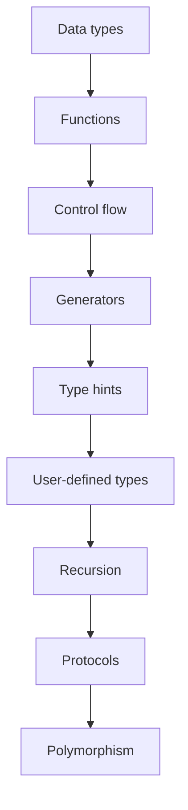
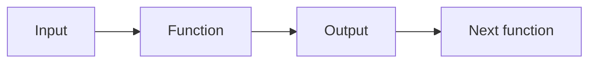
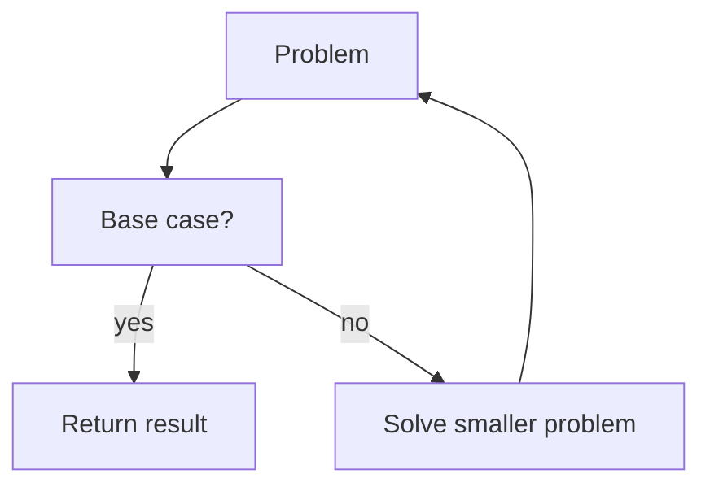

# Diagrams

## Module relationships

```mermaid
flowchart TD
    A[Data types] --> B[Functions]
    B --> C[Control flow]
    C --> D[Generators]
    D --> E[Type hints]
    E --> F[User-defined types]
    F --> G[Recursion]
    G --> H[Protocols]
    H --> I[Polymorphism]
```

## Function pipeline

```mermaid
flowchart LR
    X[Input] --> M[Function]
    M --> N[Output]
    N --> O[Next function]
```

## Recursion idea

```mermaid
flowchart TD
    A[Problem] --> B[Base case?]
    B -- yes --> C[Return result]
    B -- no --> D[Solve smaller problem]
    D --> A
```
