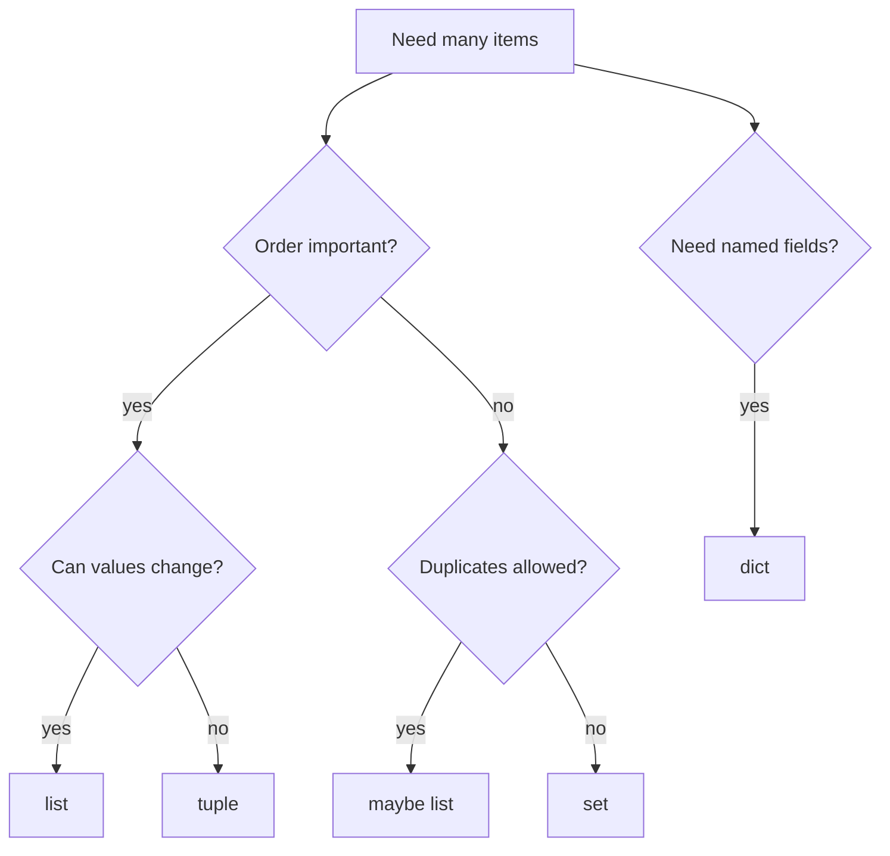
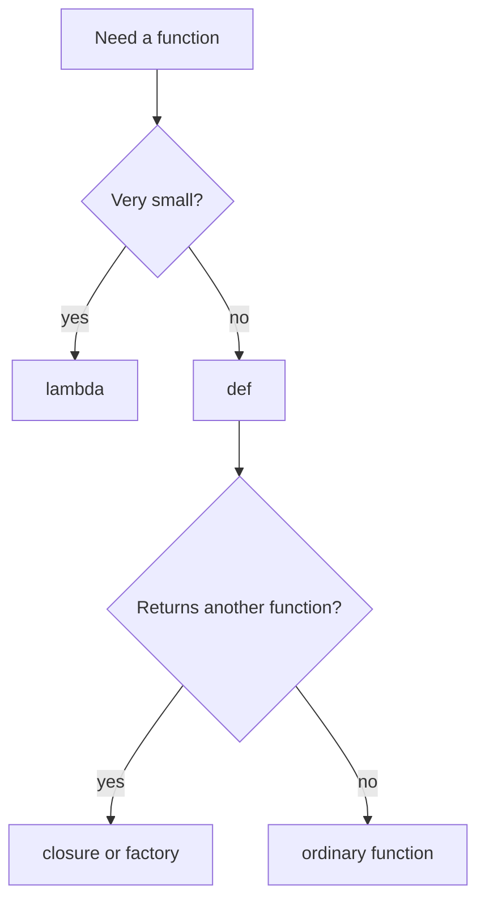
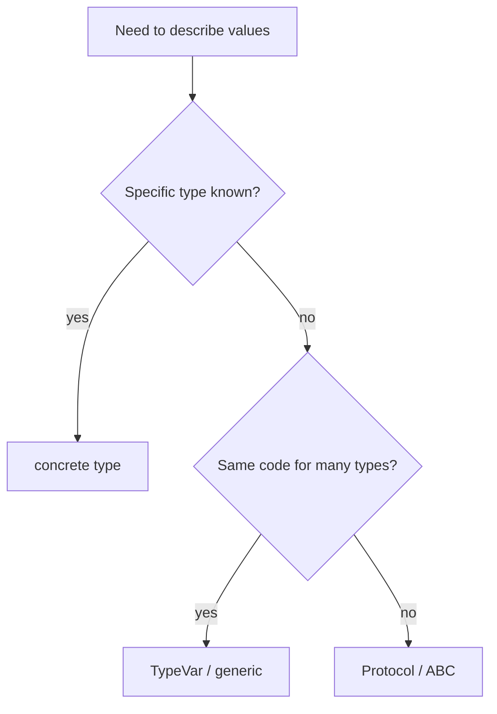

# Flowcharts

## Choose a collection

```mermaid
flowchart TD
    A[Need many items] --> B{Order important?}
    B -- yes --> C{Can values change?}
    C -- yes --> L[list]
    C -- no --> T[tuple]
    B -- no --> D{Duplicates allowed?}
    D -- yes --> M[maybe list]
    D -- no --> S[set]
    A --> K{Need named fields?}
    K -- yes --> D1[dict]
```

## Choose a function style

```mermaid
flowchart TD
    A[Need a function] --> B{Very small?}
    B -- yes --> C[lambda]
    B -- no --> D[def]
    D --> E{Returns another function?}
    E -- yes --> F[closure or factory]
    E -- no --> G[ordinary function]
```

## Choose a type approach

```mermaid
flowchart TD
    A[Need to describe values] --> B{Specific type known?}
    B -- yes --> C[concrete type]
    B -- no --> D{Same code for many types?}
    D -- yes --> E[TypeVar / generic]
    D -- no --> F[Protocol / ABC]
```
